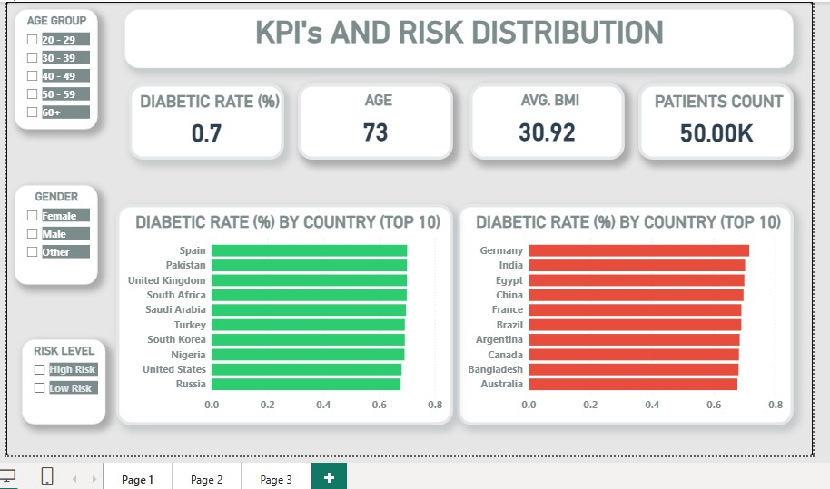
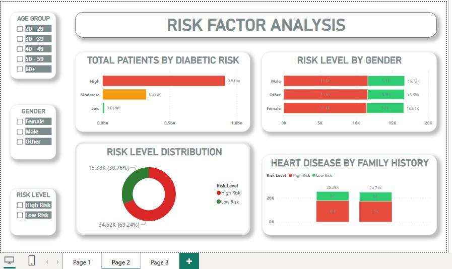
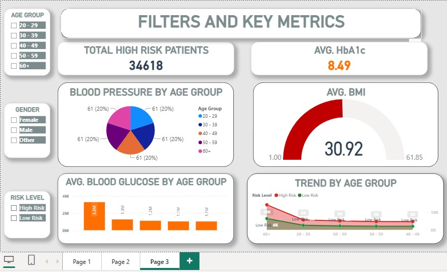

# 🩺 Diabetes Risk Analysis

**Prepared by:** Ubong Solomon

---

## 1. Introduction

Diabetes remains one of the most widespread chronic health conditions globally, and early identification of high-risk patients is critical for effective intervention and resource planning. This project analyzes a population-level diabetes risk dataset through an interactive Power BI dashboard, converting raw patient health metrics into insights that support decisions on risk screening priorities, resource allocation, and preventive care strategy.

The goal of this report is to summarize the dashboard's findings in a structured format for management review, and to translate the numbers into clear, actionable recommendations.

---

## 2. Data Description

The dataset underlying this dashboard covers health and demographic records for a large patient population. Each record includes:

| Field | Description |
|---|---|
| Patient ID | Unique identifier per patient |
| Age Group | 20–29, 30–39, 40–49, 50–59, 60+ |
| Gender | Female, Male, Other |
| Risk Level | High Risk, Low Risk (with a Moderate tier also referenced in one view) |
| Diabetic Rate (%) | Share of patients diagnosed diabetic |
| BMI | Body Mass Index |
| HbA1c | Average blood glucose measure (glycated hemoglobin) |
| Blood Glucose | Blood glucose reading |
| Blood Pressure | Blood pressure reading, segmented by age group |
| Family History | Whether the patient has a family history of heart disease |
| Country | Patient's country of residence |

**Scope:** 50,000 patients (50.00K), filterable by Age Group, Gender, and Risk Level.

---

## 3. Methodology

The analysis followed these steps:

1. **Data consolidation** – Patient demographic, clinical measurement, and risk-classification records were combined into a single structured table.
2. **Data cleaning** – Records were checked for missing values, inconsistent country naming, and correct classification into High Risk / Low Risk / Moderate tiers.
3. **Aggregation** – Diabetic rate, risk level, BMI, HbA1c, and blood glucose were aggregated by country, gender, age group, and family history.
4. **Visualization** – Aggregated measures were built into an interactive Power BI dashboard using bar charts, a donut chart, stacked bar charts, a pie chart, a gauge, and a trend line, with slicers for Age Group, Gender, and Risk Level.
5. **Interpretation** – Patterns in the visualized data were reviewed to surface high-risk concentrations and areas warranting clinical or management attention.

**Tool used:** Power BI Desktop

---

## 4. Analysis and Findings

### 4.1 Overall Performance

| Metric | Value |
|---|---|
| Diabetic Rate (%) | **0.7 (70%)** |
| Average Age | **73** |
| Average BMI | **30.92** |
| Patients Count | **50,000** |
| Average HbA1c | **8.49** |
| Total High Risk Patients | **34,618** |

Both the average BMI (30.92, in the obese range) and average HbA1c (8.49, above the ~5.7–6.4% pre-diabetic range and well above the normal range) point to a population with elevated overall metabolic and diabetes risk.

### 4.2 Diabetic Rate by Country (Top 10, two views) 
The dashboard displays two "Top 10" country lists — Spain, Pakistan, United Kingdom, South Africa, Saudi Arabia, Turkey, South Korea, Nigeria, United States, and Russia (green) alongside Germany, India, Egypt, China, France, Brazil, Argentina, Canada, Bangladesh, and Australia (red). Diabetic rates across both lists sit in a narrow, elevated band of roughly **65%–72%**, indicating high diabetic prevalence is broadly distributed across countries rather than concentrated in a few outliers.

### 4.3 Total Patients by Diabetic Risk
- High Risk: **0.91bn**
- Moderate Risk: **0.33bn**
- Low Risk: **0.01bn**

(These figures represent an aggregated volume measure, not a patient headcount — see Section 4.4 for patient-level risk counts.) The heavy skew toward High Risk relative to Moderate and Low Risk confirms that risk is concentrated at the top of the scale.

### 4.4 Risk Level Distribution (Patient Count) 
- High Risk: **34,618 patients (69.24%)**
- Low Risk: **15,382 patients (30.76%)**

Roughly **7 in 10 patients** in the dataset fall into the High Risk category.

### 4.5 Risk Level by Gender
- Male: **16.72K patients** (~11.6K High Risk / ~5.1K Low Risk)
- Other: **16.68K patients** (~11.6K High Risk / ~5.1K Low Risk)
- Female: **16.61K patients** (~11.4K High Risk / ~5.2K Low Risk)

Risk is distributed almost evenly across gender groups, both in total headcount and in High/Low Risk split.

### 4.6 Heart Disease by Family History
- With family history: **25.29K patients**
- Without family history: **24.71K patients**

Patients with a family history of heart disease show a modestly higher share of High Risk classification than those without, though total volumes are nearly identical between the two groups.

### 4.7 Blood Pressure by Age Group
Each of the five age groups (20–29, 30–39, 40–49, 50–59, 60+) contributes an equal **61 readings (20% each)** to the blood pressure breakdown, indicating an evenly balanced sample across age groups for this measure.

### 4.8 Average Blood Glucose by Age Group
- 60+: **highest, ~3M+** (markedly above all other groups)
- 20–29: **1.3M**
- 50–59: **1.2M**
- 30–39: **1.1M**
- 40–49: **1.1M**

Patients aged 60+ show a substantially higher average blood glucose reading than every other age group.

### 4.9 Trend by Age Group (High Risk vs. Low Risk)
High Risk levels are highest among the **60+ age group** and decline sharply moving to younger age groups, while Low Risk remains consistently low across all age groups. This reinforces that age is a strong driver of diabetes risk in this population.

---

## 5. Key Insight

- **The population sampled is heavily high-risk.** 69.24% of patients (34,618 of 50,000) are classified High Risk, with an average BMI of 30.92 and average HbA1c of 8.49 — both indicative of significant diabetes risk.
- **Age 60+ is the single strongest risk driver.** This group shows both the highest average blood glucose and the highest concentration of High Risk classification, with risk declining sharply in younger age groups.
- **Diabetic rate is broadly, not narrowly, distributed globally.** Top-10 countries on both lists cluster in a narrow 65–72% band rather than showing a few extreme outliers.
- **Gender is not a major differentiator of risk.** Male, Female, and Other groups show nearly identical total patient counts and High/Low Risk splits.
- **Family history has a modest, not dominant, effect.** Patients with a family history of heart disease show only a slightly higher High Risk share than those without.

---

## 6. Recommendation

1. **Prioritize screening and intervention programs for patients aged 60+**, given their markedly elevated blood glucose and High Risk concentration relative to all other age groups.
2. **Treat High Risk management as a population-wide priority**, not a niche concern — with nearly 7 in 10 patients classified High Risk, resourcing should reflect this as the default case rather than the exception.
3. **Design gender-neutral screening and outreach programs**, since risk is distributed almost evenly across Male, Female, and Other groups.
4. **Incorporate family history as a secondary, not primary, screening factor**, given its modest effect size relative to age.
5. **Investigate the underlying drivers of the consistently elevated diabetic rate (65–72%) across all top-10 countries**, to determine whether this reflects a genuine global pattern or a data/methodology artifact worth validating.
6. **Monitor average BMI (30.92) and HbA1c (8.49) as ongoing population health indicators**, tracking whether targeted interventions shift these metrics over time.

---

## 7. Conclusion

This analysis of 50,000 patient records reveals a population with a substantial diabetes risk burden: 69.24% of patients are classified High Risk, with an average BMI of 30.92 and average HbA1c of 8.49 — both markers of significant metabolic concern. Age is the strongest identifiable driver of risk, with patients 60 and older showing the highest blood glucose levels and the greatest concentration of High Risk classification, while gender shows little differentiating effect. Diabetic prevalence also appears broadly elevated (65–72%) across a wide range of countries rather than concentrated in a few. Together, these findings support prioritizing age-based screening, treating high risk as the population norm rather than the exception, and continuing to monitor key metabolic indicators to guide preventive care and resource planning going forward.

---

**Prepared by:** Ubong Solomon
